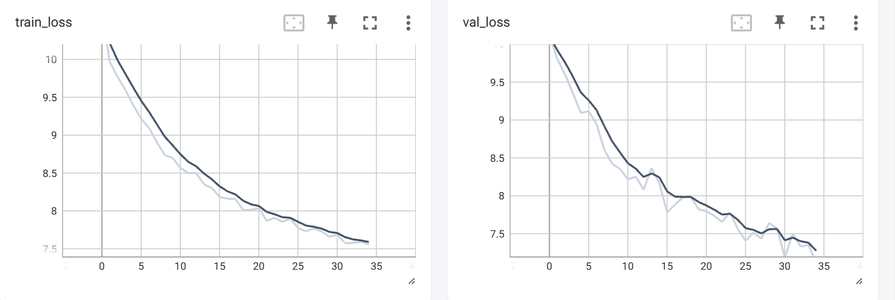

## BERT From Scratch

Research Paper : https://arxiv.org/pdf/1810.04805


## Execution Instruction


1. Install requirements
```
pip install -r requirements.txt
```

2. Download data
```
sh download_data.sh
```

3. Data Cleaning: [data_cleaning.ipynb](data_cleaning.ipynb)

4. Train Tokenizer
```
python train_tokenizer.py
```

5. Train model
```
python train_model.py
```


## Train Loss



